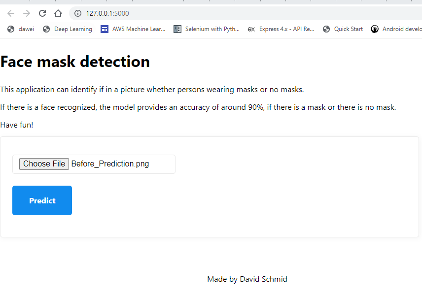
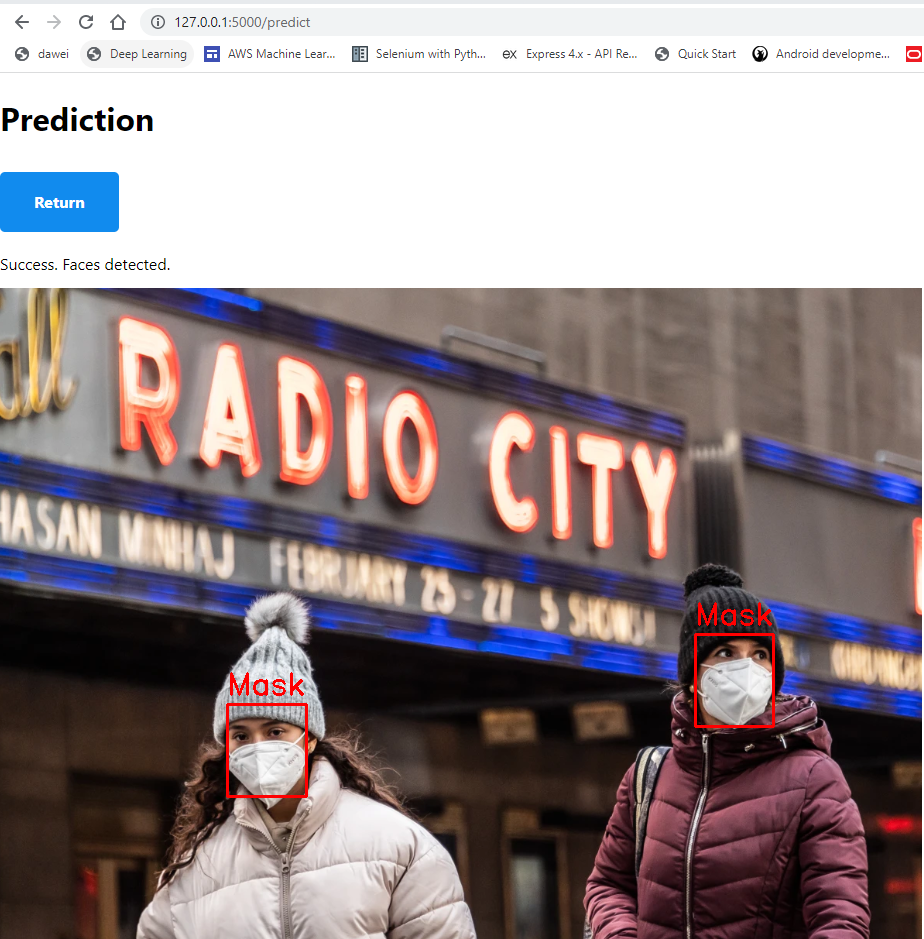

# Face mask detection - LSML2 Final project
The app can recognize faces and predict, if they wear "masks" or "no masks" (Binary image classification).

### Dataset
The Dataset is available here: https://www.kaggle.com/datasets/wobotintelligence/face-mask-detection-dataset/code  
The dataset is provided by Wobot Intelligence a, which provides artificial intelligence-based solution for video analytics. 
The dataset has a size over 2.6gb and contains 6'024 images. For Github size limitation deleted Images 1-1800 & 5000 - 6024.
- Only 4'326 images are labeled with binary class "face_with_mask", "face_no_mask". These images can be used for train and validation set. For a binary classification this is sufficient.
- The rest of the images 1'698 (6'024 - 4'326) can be used for experimental test inputs. However, since it is not labeled, the validation if correct or not has to be done by human intelligence.

### Model
1) For face recognition I used a pretrained model
2) The prediction task, whether a face wears a mask or no mask, is done by Scratch.
It is done by a CNN-DL-model with 4 convolutions. The hardest part was not to overfit the training model.
The last layer is binary, to classify "mask" or "no mask". The prediction accuracy is 89% on the validation set,
which seems to be sufficient.

## How to deploy the app

1) Clone the repository `git clone https://github.com/dawei7/LSML2_DavidSchmid`
2) Go to project's folder and run in CMD `docker compose up`
3) Everything is automatically downloaded. There is only a single container, however it is around 3gb large, therefore initially needs some time.
4) When it is ready, go to web browser `http://127.0.0.1:5000/`

## Jupyter Notebook (Optional)
- In the Juypter Notebook, all steps from data preprocessing, modelling and evaluation are documented and the output visible.
- If you want to recalculate the steps done in the notebook, please follow these steps:
1) Clone the repository `git clone https://github.com/dawei7/LSML2_DavidSchmid`
2) Go to project's folder and run in CMD `pip install virtualenv` (if you don't already have virtualenv installed)
3) `Virtualenv venv` to create your new environment (called 'venv' here)
4) `venv/Scripts/activate` to activate the virtual environment
5) RUN pip install -r requirements.txt

## How to work with the app
- Select any image from internet, cut/save it on your desktop in any image format.
- Upload the image and press on Predict
- Inspect the result

<table>
<tr>
  <td></td>
  <td></td>
</tr>
</table>